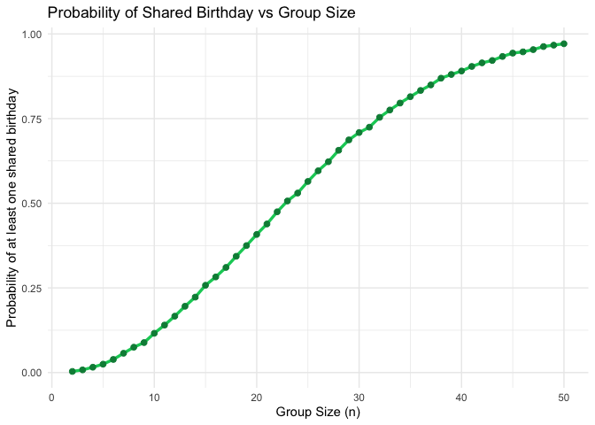
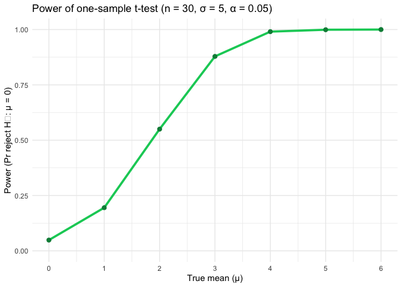
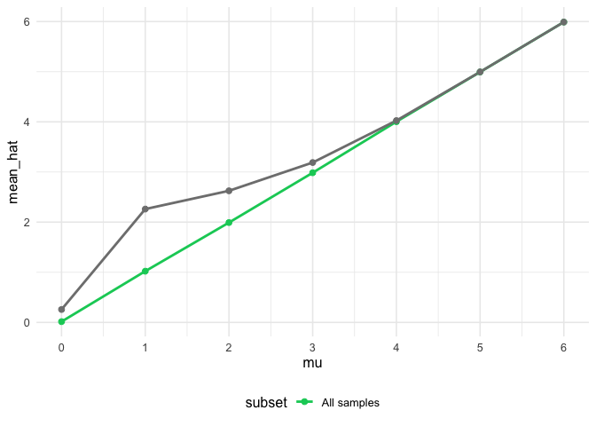

p8105_hw3_at3583
================
Alexandria D.Taylor,
2025-11-10

**<small><em>Overview: This homework applied .</small></em>**

# Problem 1 – Birthday Simulation

``` r
#generate & run birthday simulation function

birthday_sim = function(n) {
  birthdays = sample(1:365, size = n, replace = TRUE)
  any(duplicated(birthdays))
}

#run birthday simulation function for group sizes 2 to 50 at 10,000 times each

set.seed(123)

group_sizes = 2:50

simulate_results = tibble(
  group_size = group_sizes,
  prob_shared_birthday = map_dbl(group_sizes, function(n) {
    mean(replicate(10000, birthday_sim(n)))
    
  })
)

#data summary:compute the smallest group size where probability >= 0.5
threshold_50 <- simulate_results %>%
  filter(prob_shared_birthday >= 0.5) %>%
  slice(1) %>%
  pull(group_size)
```

``` r
#probability vs group size plot

simulate_results %>%
  ggplot(aes(x = group_size, y = prob_shared_birthday)) +
  geom_line(color = primary_color, size = 1.2) +
  geom_point(color = accent_color, size = 2) +
  labs(
    title = "Probability of Shared Birthday vs Group Size",
    x = "Group Size (n)",
    y = "Probability of at least one shared birthday"
  ) +
  theme_minimal()
```

<!-- -->

Summary: The likelihood that two people in a group share the same
birthday increases rapidly with group size. Despite there being 365
possible birth dates, the probability exceeds 50% once the group size
reaches **23 people**, a counterintuitive result known as the *birthday
paradox*. By around **50 individuals**, the chance is nearly certain,
making a shared birthday almost guaranteed.

# Problem 2 – One Sample t-test

``` r
#generate t-test parameters

set.seed(8105)

n_sims <- 5000
n      <- 30
sigma  <- 5

#true means to test 
mus    <- 0:6 
alpha  <- 0.05
```

``` r
# set-up n_sims dataset simultation at true mean mu

simulate_for_mu <- function(mu, n, sigma, n_sims, alpha = 0.05) {
  purrr::rerun(n_sims, rnorm(n, mean = mu, sd = sigma)) |>
    purrr::set_names(NULL) |>
    purrr::map_dfr(function(x) {
      tt <- t.test(x, mu = 0)
      tibble(
        mu      = mu,
        mu_hat  = mean(x),
        p_val   = broom::tidy(tt)$p.value,
        reject  = p_val < alpha
      )
    })
}

# run n_sims dataset simultation 

sim_results <- purrr::map_dfr(mus, simulate_for_mu, n = n, sigma = sigma, n_sims = n_sims, alpha = alpha)
```

## Power by effect size (mu)

``` r
#generate power datafram from simulation results
power_df <- sim_results |>
  group_by(mu) |>
  summarise(power = mean(reject), .groups = "drop")

#generate average estimates-- overall vs. conditional on reject
estimates_df <- sim_results |>
  group_by(mu) |>
  summarise(
    mean_hat_all    = mean(mu_hat),
    mean_hat_reject = mean(mu_hat[reject]),
    .groups = "drop"
  ) |>
  tidyr::pivot_longer(
    cols = c(mean_hat_all, mean_hat_reject),
    names_to = "subset",
    values_to = "mean_hat"
  ) |>
  mutate(subset = recode(subset,
                         mean_hat_all = "All samples",
                         mean_hat_reject = "Only rejected H0"))
```

``` r
#plot power df
power_df |>
  ggplot(aes(x = mu, y = power)) +
  geom_line(color = primary_color, linewidth = 1.3) +
  geom_point(color = accent_color, size = 2.2) +
  scale_x_continuous(breaks = mus) +
  coord_cartesian(ylim = c(0, 1)) +
  labs(
    title = "Power of one-sample t-test (n = 30, σ = 5, α = 0.05)",
    x = "True mean (μ)",
    y = "Power (Pr reject H₀: μ = 0)"
  ) +
  theme_minimal()
```

<!-- -->
Summary: The probability of rejecting the null hypothesis increases as
the true mean (μ) increases. When μ is close to 0, the test seldom
rejects the null, indicating low power. As μ becomes larger, the effect
becomes more detectable relative to noise, and power rises rapidly
toward 1. This illustrates the fundamental principle that the expected
relationship that larger effect sizes yield greater power in hypothesis
testing.

``` r
# plot-estimates dataframe
estimates_df |>
  ggplot(aes(x = mu, y = mean_hat, color = subset)) +
  geom_line(linewidth = 1) +
  geom_point(size = 2) +
  scale_x_continuous(breaks = mus) +
  scale_color_manual(values = c("All samples" = primary_color,
                               "Reject H₀ only" = accent_color))
```

<!-- -->

``` r
  labs(
    title = "Average estimate of μ̂ vs true μ",
    subtitle = "Conditioning on rejection inflates μ̂ (selection bias)",
    x = "True mean (μ)",
    y = "Average μ̂",
    color = ""
  ) +
  theme_minimal()
```

    ## NULL

Summary: Across all simulated samples, the average estimate of μ̂ closely
matches the true mean μ, indicating that the estimator is unbiased.
However, when considering only samples where the null hypothesis was
rejected, the average μ̂ is inflated above the true value. This occurs
because under low power, only the more extreme sample means yield
produce significant results, introducing selection bias.

# Problem 3 – Washington Post

``` r
library(tidyverse)
library(janitor)
library(broom)
library(purrr)

# Load and clean homicide data
homicide_df <- read_csv("https://raw.githubusercontent.com/washingtonpost/data-homicides/master/homicide-data.csv") |>
  clean_names()

# create city_state variable & flag unsolved cases
homicide_city <- homicide_df |> 
  mutate(
    city_state = str_c(city, ", ", state),
    unsolved = disposition %in% c("Closed without arrest", "Open/No arrest")
  )
city_summary <- homicide_city |> 
  group_by(city_state) |> 
  summarise(
    total_homicides = n(),
    unsolved_homicides = sum(unsolved),
    .groups = "drop"
  )

knitr::kable(city_summary, caption = "Homicide counts and unsolved cases by city")
```

| city_state         | total_homicides | unsolved_homicides |
|:-------------------|----------------:|-------------------:|
| Albuquerque, NM    |             378 |                146 |
| Atlanta, GA        |             973 |                373 |
| Baltimore, MD      |            2827 |               1825 |
| Baton Rouge, LA    |             424 |                196 |
| Birmingham, AL     |             800 |                347 |
| Boston, MA         |             614 |                310 |
| Buffalo, NY        |             521 |                319 |
| Charlotte, NC      |             687 |                206 |
| Chicago, IL        |            5535 |               4073 |
| Cincinnati, OH     |             694 |                309 |
| Columbus, OH       |            1084 |                575 |
| Dallas, TX         |            1567 |                754 |
| Denver, CO         |             312 |                169 |
| Detroit, MI        |            2519 |               1482 |
| Durham, NC         |             276 |                101 |
| Fort Worth, TX     |             549 |                255 |
| Fresno, CA         |             487 |                169 |
| Houston, TX        |            2942 |               1493 |
| Indianapolis, IN   |            1322 |                594 |
| Jacksonville, FL   |            1168 |                597 |
| Kansas City, MO    |            1190 |                486 |
| Las Vegas, NV      |            1381 |                572 |
| Long Beach, CA     |             378 |                156 |
| Los Angeles, CA    |            2257 |               1106 |
| Louisville, KY     |             576 |                261 |
| Memphis, TN        |            1514 |                483 |
| Miami, FL          |             744 |                450 |
| Milwaukee, wI      |            1115 |                403 |
| Minneapolis, MN    |             366 |                187 |
| Nashville, TN      |             767 |                278 |
| New Orleans, LA    |            1434 |                930 |
| New York, NY       |             627 |                243 |
| Oakland, CA        |             947 |                508 |
| Oklahoma City, OK  |             672 |                326 |
| Omaha, NE          |             409 |                169 |
| Philadelphia, PA   |            3037 |               1360 |
| Phoenix, AZ        |             914 |                504 |
| Pittsburgh, PA     |             631 |                337 |
| Richmond, VA       |             429 |                113 |
| Sacramento, CA     |             376 |                139 |
| San Antonio, TX    |             833 |                357 |
| San Bernardino, CA |             275 |                170 |
| San Diego, CA      |             461 |                175 |
| San Francisco, CA  |             663 |                336 |
| Savannah, GA       |             246 |                115 |
| St. Louis, MO      |            1677 |                905 |
| Stockton, CA       |             444 |                266 |
| Tampa, FL          |             208 |                 95 |
| Tulsa, AL          |               1 |                  0 |
| Tulsa, OK          |             583 |                193 |
| Washington, DC     |            1345 |                589 |

Homicide counts and unsolved cases by city

Summary: The dataset includes 52179 homicide records from 50 U.S.
cities, with 12 variables detailing victim demographics (age, sex,
race), geographic information, and case outcomes. Each row represents a
single homicide incident. Some fields contain missing data – 0 cases
lack recorded victim race—and several disposition categories required
recoding to determine whether a case is solved. In this analysis, both
*Open/No arrest* and *Closed without arrest* are classified as unsolved.

## Baltimore, MD

``` r
# filter data to Baltimore
baltimore_df <- homicide_city |> 
  filter(city_state == "Baltimore, MD")

# run prop test
baltimore_test <- prop.test(
  x = sum(baltimore_df$unsolved),
  n = nrow(baltimore_df)
)

# tidy filtered results
baltimore_summary <- baltimore_test |> 
  broom::tidy() |> 
  select(estimate, conf.low, conf.high)

baltimore_summary
```

    ## # A tibble: 1 × 3
    ##   estimate conf.low conf.high
    ##      <dbl>    <dbl>     <dbl>
    ## 1    0.646    0.628     0.663

The estimated proportion of unsolved homicides in Baltimore is
**0.646**, with a 95% confidence interval of **(0.628, 0.663)**.
